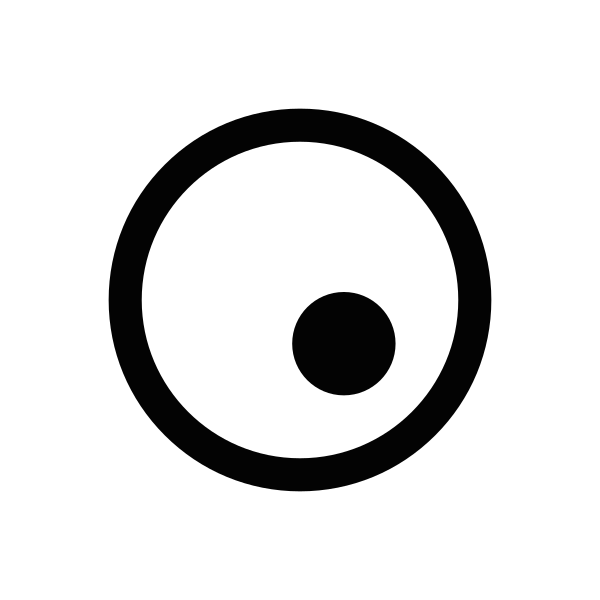
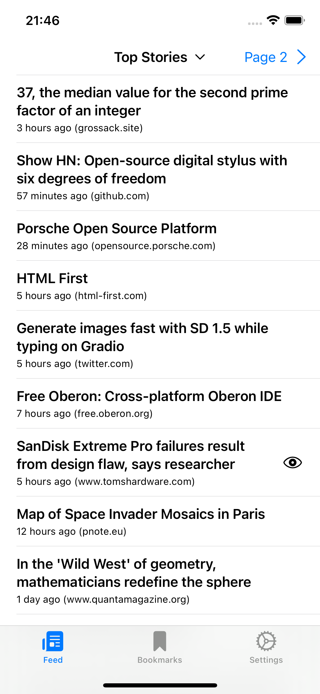
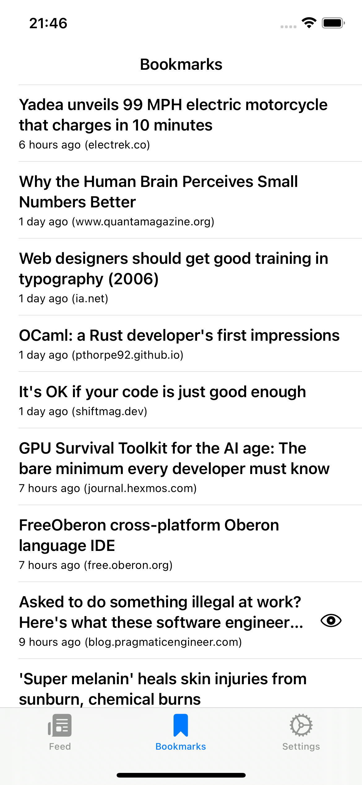
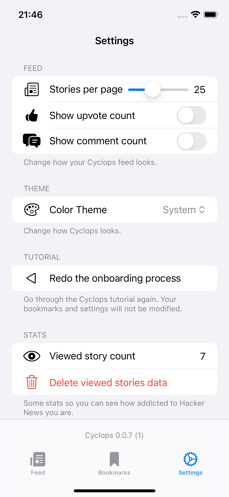
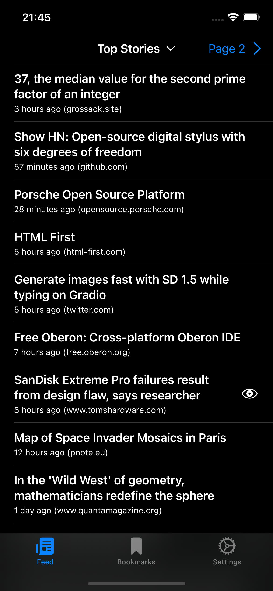

    

# Cyclops Reader

> The _simplest_ Hacker News reader.

It provides a small set of features:

- Bookmarks
- Customizable feed length
- Toggleable post stats
- Personal stats
- Dark & light mode

And a set of anti-features:

- No infinite scroll — for obvious reasons
- No comments — shielding you from _other_ people's bad opinions
- Harder to reach buttons — to discourage you from going to the next page non-stop

## Screenshots

  
  
  
  

